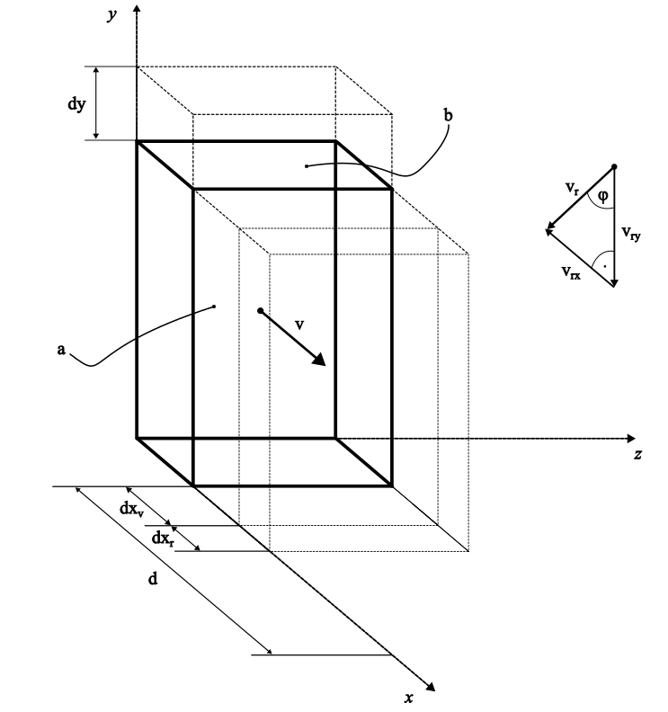
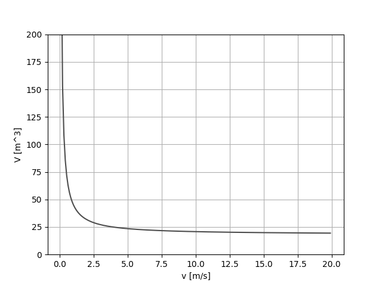
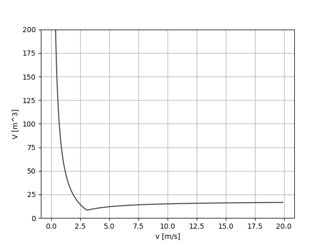

# To Walk or To Run?
You come back from shopping and arrive to your driveway. It's time to get home. However, it rains and it will be raining for next 2 hours.

How to get home, so that you get there with your bags as dry as possible?

## Physical model
The amount of raindrops that you'll have contact with on your way home depends on:
1. your dimensions: for simplicity your body will be approximated as a cuboid. In this cuboid, its front and top area will be considered and described by $a$ and $b$ coefficients, respectively, where:
```math
a = width \cdot height
```
```math
b = width \cdot depth
```
2. your velocity $v$,
3. distance to your home $d$,
4. rain velocity $v_r$ and angle $\phi$.

Figure below is a conceptual model explaining how a small increment of rain volume is determined as sum of subvolumes related to both your and rain movement along $x$ and $y$ axis directions.

<p align="center"></p>

It can be written, that:
```math
dV = adx_v - adx_r - bdy \qquad \vert : dt
```
```math
\frac{dV}{dt} = a\frac{dx_v}{dt} - a\frac{dx_r}{dt} - b\frac{dy}{dt}
```

From the figure it can be seen that:
```math
\frac{dx_v}{dt} = v
```
```math
\frac{dx_r}{dt} = v_{r_{x}} = v_r\cos(\phi)
```
```math
\frac{dy}{dt} = v_{r_{y}} = v_r\sin(\phi)
```

Substituting the relationships above to the volume equation:
```math
\frac{dV}{dt} = av - av_r\cos(\phi) - bv_r\sin(\phi) \qquad \vert \int dt
```
```math
\int dV = \int av dt - \int av_r\cos(\phi) dt - \int bv_r\sin(\phi) dt
```
The final result:
```math
V(t) = |as(t) - atv_r\cos(\phi)| - btv_r\sin(\phi)
```
Modulus above makes sure that the volume increment remains positive in case where $dx_r > dx_v$, which can be a situation of you moving along the horizontal direction of the rain.
This equation provides the information on the total amount/volume of water you encountered on your way home $s(t)$ at each second of your way there.

What is do determine, is the V(v(t)). Knowing, that v(t) is constant, it can be expressed as:
```math
v = \frac{d}{t_d}
```
where $t_d$ is a time needed for traveling the distance $d$.
Therefore, the volume equation can be written as:
```math
V(v) = |ad - a\frac{d}{v}v_r\cos(\phi)| - b\frac{d}{v}v_r\sin(\phi)
```
## Answer
### Rain with no wind
The plot below shows the amount of rain falling in environment with following parameters:
- human cuboid dimensions:
  - height = $1.81 \text{ } m$
  - width = $0.5 \text{ } m$
  - depth = $0.3 \text{ } m$
- environment:
  - v_r = $-9 \text{ } \frac{m}{s}$
  - phi = $0^{\circ}$
  - d = $20 \text{ } m$
  - 
<p align="center"></p>

 Conclusion? Run as fast as you can! The faster you sprint, the drier you and your shopping will get home.

 ### Rain with wind
 What about a scenario where the rain falls with some non-zero angle? For this purpose, the same parameters as before have been used, but the $\phi$ has been set to $-20^{\circ}$. This situation, with respect to the figure above, means that the rain horizontal velocity direction is heading the direction of your house door.
 The plot below answers what happens in such circumstances:
<p align="center"></p>

Turns out, that there is an optimal speed with which you can run to get home the driest possible! In practice, however, it may be difficult to make it remain at this particular value (especially when you run with heavy full shopping bags) and therefore, seems like it is the best to run as fast as you can.

